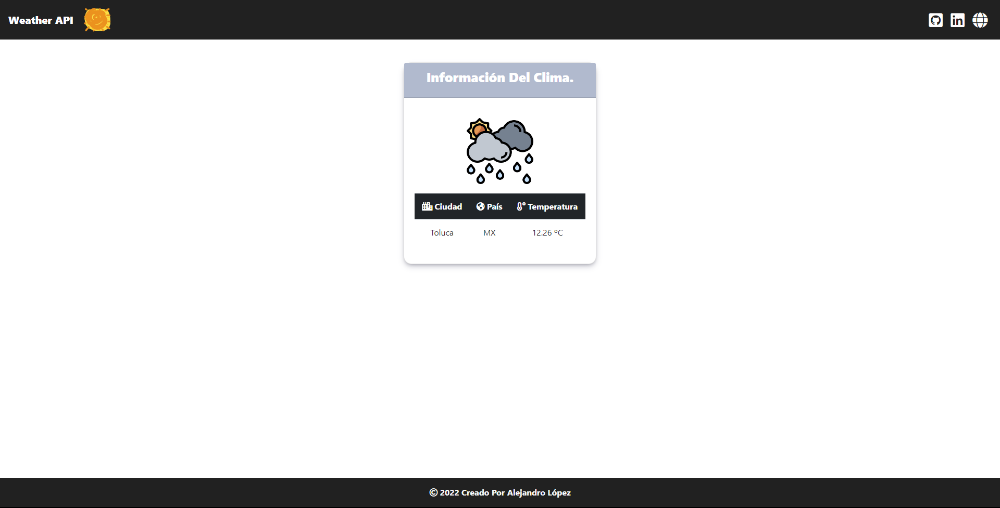

# <h1 align="center" style="color: #80cbc4;"> Weather API 👨🏻‍💻 </h1> 
  

`What is an API for weather?`  
A weather API is an Application Programming Interface that allows weather data to be queried from scripts and code. Weather APIs provide both historical weather data and forecast data via an easy-to-use, well-defined programming interface.
          
  

## 
 Requirements 

- [HTML5](https://developer.mozilla.org/es/docs/Web/HTML) 
- [CSS3](https://developer.mozilla.org/es/docs/Web/CSS)
- [PHP](https://www.php.net/manual/es/intro-whatis.php)

## 
 References 

- [Weather API](https://openweathermap.org/)

  

## 
 Screenshot Project 💻 

🔶 [Project Website](https://alejandro-lopez.futuretecware.com/Weather-API/index.php)

